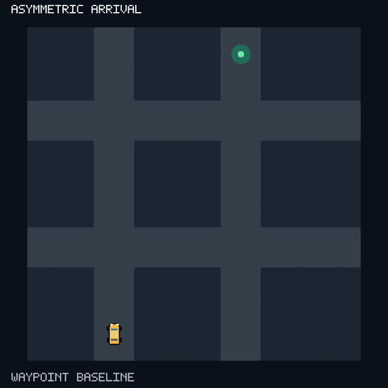

# Flybrain — Stage 1 open arena & Stage 2 street grid

A kinematic car receives heading and goal-bearing cues and is steered by a
rate-model neural network over the full prepared MaleCNS v1.0 connectome.
Stage 2 adds fixed street grids with buildings, five local range sensors, and
variable speed — the controller still never sees the map. See
[ROADMAP.md](ROADMAP.md), the [Stage 1 plan](docs/superpowers/plans/2026-09-11-stage-1-driving.md),
and the [Stage 2 plan](docs/superpowers/plans/2026-09-12-stage-2-street-grid.md).

## Current status

The connectome pipeline, arena, neural runtime, adapter calibration, controls
harness, and pygame replay are implemented. On the frozen Stage 1 held-out set,
the connectome controller arrived in 20/100 trials; the separately labeled
conventional baseline arrived in 100/100. On the Stage 2 street-grid held-out
set, the connectome controller arrived in 33/100 trials. Neither neural result
meets its exit condition. Later Stage 2 experiments test navigation baselines
and learned policies; the Stage 2h PPO policies failed their readiness split
(0/300 arrivals), so their one-shot gate was not opened. See [HANDOFF.md](HANDOFF.md)
for the results and limits.

## Run it

Follow [SETUP.md](SETUP.md) to download and prepare the data, then run:

```sh
python -m unittest test_stage1 -q
python simulation.py --benchmark --seconds 60 --data data/malecns-v1.0
python viewer.py --controller neural --data data/malecns-v1.0 \
  --checkpoint runs/stage1/checkpoint.json
```

Generated calibration, scenario, trajectory, and control artifacts are under
`runs/stage1/`. The repository records the frozen calibration scenarios,
checkpoint, held-out set, and example trajectories for reproducibility.

## Stage 2 — street grid

Three fixed connected grids (`cross`, `regular`, `asymmetric`). The controller
receives heading, destination bearing, current speed, and five local range
readings only — never a layout, building, target coordinate, or route. Only
`avoidance_gain` and `brake_distance` are calibrated in Stage 2; Stage 1 neural
dynamics and the PFL3 adapter `gain`/`bias` stay frozen.

### Asymmetric layout arrival video



[Download the 16-second MP4](https://raw.githubusercontent.com/Chieler/flybrain/master/docs/media/asymmetric_arrival.mp4). The car
travels from the bottom of the layout to a goal near the opposite edge, making
two turns. This is recorded Stage 2b scenario `stage2b-asymmetric-002` using the
**waypoint baseline**, which has access to the layout and planned route. It is
an evaluator-only solvability witness, not a connectome-controller result.
Regenerate it with `scripts/render_asymmetric_arrival.py` using the system
Python 3.9+ and `ffmpeg`.

```sh
python -m unittest test_stage2 -q            # deterministic Stage 2 checks

# freeze the seeded splits (24 training / 100 held-out), already committed
python evaluate_stage2.py --freeze-scenarios

# real-graph calibration (12 candidates × 24 training scenarios)
python evaluate_stage2.py --calibrate \
  --data data/malecns-v1.0 --stage1-checkpoint runs/stage1/checkpoint.json \
  --training runs/stage2/training.json --heldout runs/stage2/heldout.json \
  --checkpoint runs/stage2/checkpoint.json

# six-way held-out controls (verifies source hashes before running)
python evaluate_stage2.py --controls \
  --data data/malecns-v1.0 --stage1-checkpoint runs/stage1/checkpoint.json \
  --checkpoint runs/stage2/checkpoint.json --heldout runs/stage2/heldout.json \
  --out runs/stage2/results.json

# replay a frozen Stage 2 scenario (baseline = labeled direct-compass)
python viewer.py --stage 2 --controller baseline \
  --scenarios runs/stage2/heldout.json --index 0
```

**Held-out results:** the real-graph run is complete. The neural controller
arrived in 33/100 trials (65 collisions, 2 timeouts); the labeled direct-compass
baseline arrived in 41/100. The Stage 2 exit condition was **not met**. Full
control results and per-layout counts are in [runs/stage2/README.md](runs/stage2/README.md).

## Integrity boundary

Measured wiring, assumed rate dynamics, artificial cue/motor interfaces, and
learned adapter values are kept separate. The neural controller receives only
heading, goal bearing, and pooled PFL3 outputs; it never reads target geometry.
The conventional compass controller is a labeled geometric baseline, not a
neural result. See [HANDOFF.md](HANDOFF.md) for limitations and the current
runtime budget.
